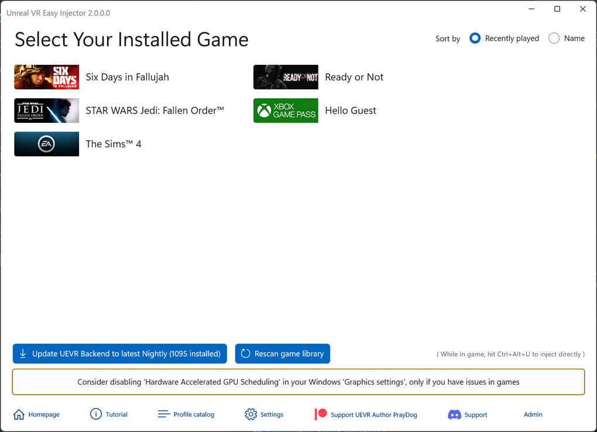

Play numerous Unreal Engine games from your Steam or EPIC library in Virtual Reality, such as with Meta Quest headsets.
This app takes [Praydog’s brilliant (UEVR)](https://github.com/praydog/UEVR) magic module, but replaces the UI part with a user-friendly, new one.   
It adds features like an **online profiles database, voice commands, user friendly profiles editor and UEVR Nightly updates with one click**.  
UEVR for the casual user, mass market compatible  ;-)  

<a href="https://github.com/oduis/UEVRDeluxe/releases" class="download-link">Download latest release</a>

New to UEVR? Read [this step by step beginners tutorial](UEVRTutorial.md)  

## Integration with Steam, EPIC, XBox Gaming, EA Games and GOG
Guides you through the process, filters installed games that may be using Unreal Engine, and provides warnings for common issues that beginners face. 
One click update to latest UEVR nightly backend version.

## Easy Profile Editor
Includes the most commonly used options with descriptions to help you get started:

## Easy to find a Profile and start the Game, including XR Runtime Switcher
The new UEVR profile database includes documentation for each profile. No more searching on Discord or outdated profile websites
(but you can still use them with UEVR Easy Injector, just like you would use them with UEVR Classic). 
Inject via hotkey while running your game, without needing to tab around with your headset on.

## In-game Voice Commands
Configure easy to use voice commands per game. Little performance overhead on RAM/CPU:

(do NOT run app as administrator for voice commands)

## Frequently Asked Questions
### Does it cost anything?
No, this is free (for non commercial use). However, you are encouraged to support the author of UEVR here: [Praydog's Patreon](https://patreon.com/praydog).
### Do I need UEVR Injector installed?
No, it is not necessary. However, it does no harm to have it installed in parallel, as long as it is not used on the same games.
### Can I use game profiles not in the database (e.g. installed manually from Discord)?
Sure, just like with UEVR classic.
### My Steam game is installed and based on Unreal Engine, but not showing up
Shut down Steam and Restart it. Then rescan in UEVR Easy Injector. Alternatively just reboot, start Steam, then UEVR Easy Injector.
### I have a great profile. How to add it to the UEVR Easy Injector database?
Follow [this guide](SubmitProfile.md)
### What UEVR version is it based on? Can I use another?
Currently the current nightly version that looks stable when published. But you can just click on Update button to download the latest nightly or older nightlies automatically. Start UEVR Easy as admin for this to work.