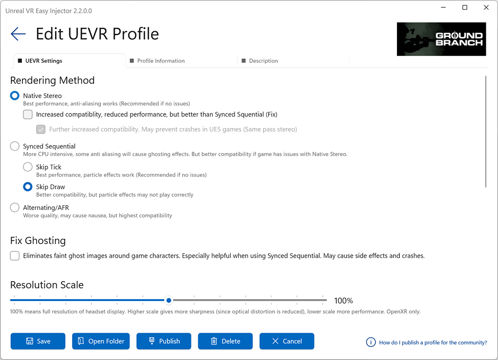
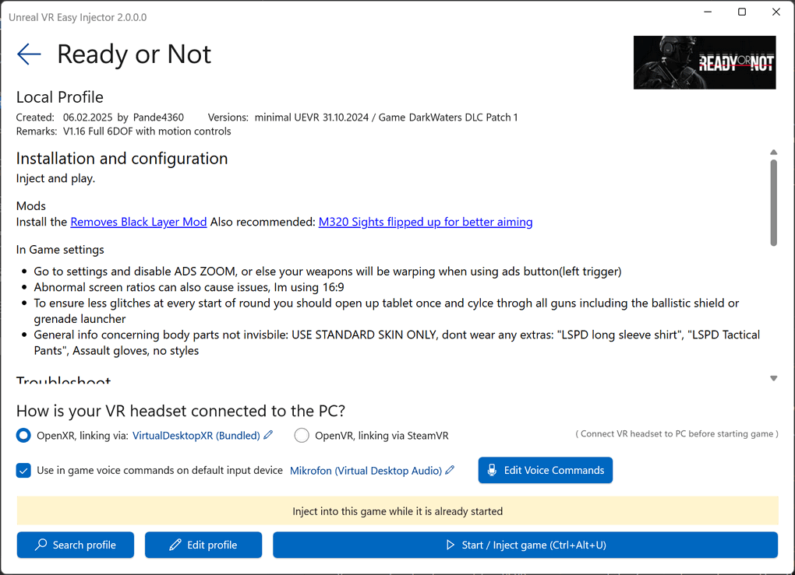

Play numerous Unreal Engine games from your Steam or EPIC library in Virtual Reality, such as with Meta Quest headsets.
This app takes [Praydog’s brilliant (UEVR)](https://github.com/praydog/UEVR) magic module, but replaces the UI part with a user-friendly, new one. It adds features like an online profiles database and voice commands. UEVR for the masses ;-)  

<a href="https://github.com/oduis/UEVRDeluxe/releases" class="download-link">Download latest release</a>

New to UEVR? Read [this step by step beginners tutorial](UEVRTutorial.md)  

## Integration with Steam, EPIC, and GOG,
Guides you through the process, filters installed games that may be using Unreal Engine, and provides warnings for common issues that beginners face:

## Easy Profile Editor
Includes the most commonly used options with descriptions to help you get started:

## Easy to find a Profile and start the Game, including XR Runtime Switcher
The new UEVR profile database includes documentation for each profile. No more searching on Discord or outdated profile websites. Inject via hotkey while running your game, without needing to tab around with your headset on.

## In-game Voice Commands
Configure easy to use voice commands per game. Little performance overhead on RAM/CPU:

## Frequently Asked Questions
### Does it cost anything?
No, this is free (for non commercial use). However, you are encouraged to support the author of UEVR here: [Praydog's Patreon](https://patreon.com/praydog).
### Do I need UEVR Injector installed?
No, it is not necessary. However, it does no harm to have it installed in parallel, as long as it is not used on the same games.
### I have a great profile. How to add it to the UEVR Easy Injector database?
Follow [this guide](SubmitProfile.md)
### What UEVR version is it based on?
Currently always the current nightly version when published. But you can replace the UEVR DLLs manually with another versions if you like. Just replace the DLLs in the "UEVR" subfolder below the folder where UEVR Easy Injector is installed with the DLLs of the nightly UEVR.
